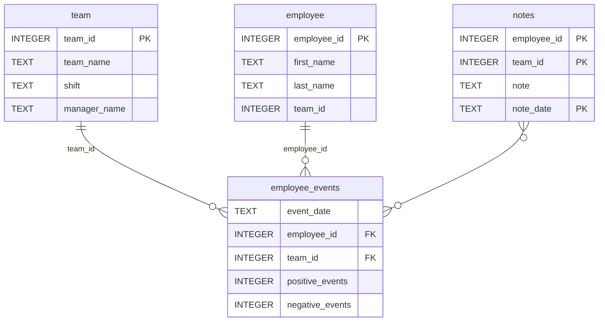

# Software Engineering for Data Scientists

## 📌 Overview
A comprehensive solution for monitoring employee performance and predicting attrition risk, consisting of:
- **Python API** for accessing employee event data
- **Interactive Dashboard** for visualization
- **ML Integration** for recruitment risk prediction

## 🛠 Technologies Used
| Category        | Technologies                          |
|-----------------|---------------------------------------|
| Backend         | Python 3.8+, FastAPI, SQLite         |
| Data Processing | Pandas, NumPy                        |
| Visualization   | Matplotlib, FastHTML                 |
| Machine Learning| Scikit-learn (pickle model)          |
| Testing         | Pytest, GitHub Actions               |
| Infrastructure  | GitHub, Uvicorn (ASGI server)        |

## 🏗 Project Structure
### Repository Structure
```
├── README.md
├── assets
│   ├── model.pkl
│   └── report.css
├── env
├── python-package
│   ├── employee_events
│   │   ├── __init__.py
│   │   ├── employee.py
│   │   ├── employee_events.db
│   │   ├── query_base.py
│   │   ├── sql_execution.py
│   │   └── team.py
│   ├── requirements.txt
│   ├── setup.py
├── report
│   ├── base_components
│   │   ├── __init__.py
│   │   ├── base_component.py
│   │   ├── data_table.py
│   │   ├── dropdown.py
│   │   ├── matplotlib_viz.py
│   │   └── radio.py
│   ├── combined_components
│   │   ├── __init__.py
│   │   ├── combined_component.py
│   │   └── form_group.py
│   ├── dashboard.py
│   └── utils.py
├── requirements.txt
├── start
├── tests
    └── test_employee_events.py
```

### employee_events.db



## 🚀 Installation & Setup
1. Clone repository:
    git clone [repository-url]
    cd [repository-name]
2. Create virtual environment:
    python -m venv venv
    source venv/bin/activate  # Linux/Mac
    venv\Scripts\activate     # Windows
3. Install dependencies:
    pip install -r requirements.txt
4. Launch dashboard:
    uvicorn report.dashboard:app --reload

## 📊 Dashboard Screenshots

### Individual Employee View


### Team Overview


